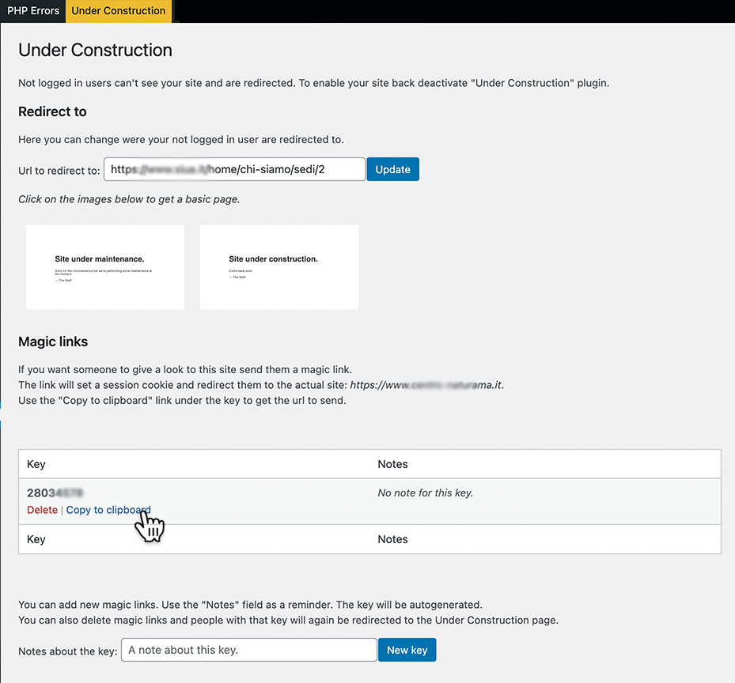

# Under Construction

**Site under construction**? Unlike many other such plugins, which create beautiful pages with countdowns, shovels and whatnot, this one **redirects** unregistered users to a page of your choosing.
Magic links allow you to create exceptions for your client, family or friends!

## Redirection
Not logged in users can't see your site and are redirected to whatever page you want.
Can be a static page on your server, an old site.
By default it redirects to a very simple [Under Construction page](#maintenance).
[Configure](#settings) the URL in the "Under Construction" page under "Settings" menu.
To enable your site back deactivate "Under Construction" plugin.

## Magic Links
Magic links permit someone to gain "preview mode" to the site.
The "Under Construction" page under "Settings" menu has a section where keys can created and deleted.
A note can be associated with the key: it can help you remember the person you sent the key to.
Under each key the "Copy to clipboard" allows you to copy a link that you can send to the person you want to see the site.
This works by creating a session cookie.

## Using with Update Manager
If [Update Manager](https://github.com/xxsimoxx/codepotent-update-manager) is installed you can skip redirections for it's endpoints by adding `define('XSX_UC_SAFE_UM', true);` to `wp-config.php`.

## REST API
This plugin disables REST API for unauthenticated users. If you want you can enable REST API adding `define('XSX_UC_SAFE_REST', true);` to `wp-config.php`.

# Screenshots

